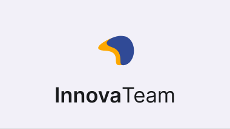

    <h1>InnovaTeam</h1>

     
    <h2>Innovación que impulsa al éxito</h2>

---

# Sobre Nosotros 🫂

En **InnovaTeam**, nuestra misión es transformar desafíos cotidianos en oportunidades de crecimiento a través de soluciones tecnológicas personalizadas. Nos enfocamos en empoderar a personas y empresas mediante el desarrollo de software innovador y accesible, diseñado para simplificar procesos, optimizar recursos y mejorar la calidad de vida. Creemos en el poder de la tecnología para conectar, inspirar y crear un impacto positivo en el mundo, brindando herramientas digitales que permitan a nuestros clientes alcanzar su máximo potencial.

  
Leer más 👇

  
  Nos especializamos en ofrecer soluciones tecnológicas a medida, ayudando a pequeñas y medianas empresas a optimizar sus procesos, reducir costos y mejorar su competitividad en el mercado digital. Nuestros servicios incluyen desarrollo de plataformas web, aplicaciones móviles, optimización de la experiencia del usuario, e integración de sistemas complejos.

  En InnovaTeam, trabajamos con un enfoque centrado en el cliente, brindando soluciones adaptadas a las necesidades y objetivos específicos de cada proyecto. Además, ofrecemos servicios de consultoría tecnológica y coaching empresarial, permitiendo a nuestros clientes desarrollar su talento interno y maximizar su potencial.

---

# Nuestros Servicios 🚀

- **Desarrollo Web**.
- **Desarrollo Móvil**.
- **Consultoría Tecnológica**.
- **Coaching Empresarial**.
- **Mantenimiento y Soporte de Sistemas**.
- **Formación y Capacitación para Desarrolladores**.

---

<h1 align="center">🛠️ Nuestras Tecnologías de Desarrollo 🛠️</h1>

    

---

# Nuestro Equipo 🧑‍💻 | Enlaces - LinkedIn ~ GitHub
 
## Fundadores
 
| Avatar                        | Nombre          | Rol                    | GitHub & Redes                                                                                                                                                                                          |
| ----------------------------- | --------------- | ---------------------- | ------------------------------------------------------------------------------------------------------------------------------------------------------------------------------------------------------- |
|  | Facundo Nuñez  | Full Stack Developer    |           |
|  | Mikhail Ivan Garcilano    | Analista Funcional    |           |
|  | Alan Rios | Full Stack Developer                    |     |
|  | Mauro Laime  | Full Stack Developer     |                 |
|  | Flor Sarkis  | Product Owner y Diseñadora ui/ux |                |

## Equipos de desarrollo

| Avatar                        | Nombre          | Rol                    | GitHub & Redes                                                                                                                                                                                          |
| ----------------------------- | --------------- | ---------------------- | ------------------------------------------------------------------------------------------------------------------------------------------------------------------------------------------------------- |
|  | Delfina Sarkis     | Full Stack Developer    |           |
|  | Rosana Herrera | Community Manager    |           |
|  | Johanna Tarabelli | Product Manager                     |     |
|  | Rodrigo Molina | Diseñador ux/ui |                |

---

<h1 align="center">Conéctate con Nosotros 🤝</h1>

    
    

    <a href="https://www.innovateam.com/">
        innovateam.com
    </a>

---
